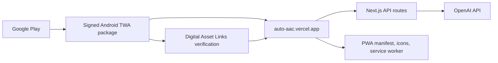

# Auto AAC Android TWA Release Design

**Date:** 2026-06-20  
**Status:** Approved for implementation planning  
**Repository:** `yangisu/Auto_AAC`  
**Production web app:** `https://auto-aac.vercel.app/`

## 1. Goal

Publish the existing Auto AAC teacher tool on Google Play with the smallest practical change to the current Next.js and Vercel architecture. The Android app must preserve the deployed web workflow, keep the OpenAI API key on the server, and satisfy Google Play release, privacy, and testing requirements.

The first Android release is an online-only teacher tool. Native-only features, offline AI generation, user accounts, payments, push notifications, and a React Native or Flutter rewrite are outside this release.

## 2. Chosen Approach

Package the deployed Progressive Web App as a Trusted Web Activity (TWA) using Bubblewrap.

This approach is preferred because Auto AAC already has:

- a production HTTPS origin on Vercel;
- a responsive interface with a mobile breakpoint;
- server-side Next.js routes for OpenAI text and image generation;
- a single web codebase that can continue receiving normal Vercel deployments.

The Android package displays verified content from `https://auto-aac.vercel.app/` without duplicating the application UI or moving server logic into the Android binary. Domain verification uses Digital Asset Links.

### Rejected alternatives

1. **Capacitor with a remote `server.url`:** lower initial effort, but Capacitor documents external `server.url` as a live-reload feature not intended for production.
2. **Capacitor with bundled web assets:** viable for later native integration, but the current Next.js UI and POST route handlers would need a separate static mobile frontend or a frontend/backend build split.
3. **React Native or Flutter rewrite:** offers the most native control but duplicates the existing UI and creates a second client codebase without helping the first-release goal.

## 3. Architecture

### Component boundaries

- **Next.js web application:** owns all teacher-facing UI, validation, storyboard editing, and calls to same-origin API routes.
- **Next.js API routes:** own OpenAI requests and keep `OPENAI_API_KEY` exclusively in Vercel environment variables.
- **PWA layer:** owns install metadata, icons, theme colors, display mode, and an offline/error fallback. It does not cache generated student content or base64 AAC images.
- **Android TWA project:** owns package identity, app signing, Android build configuration, launcher resources, and the verified launch URL. It contains no API key or student data.
- **Digital Asset Links file:** binds the Android application ID and signing certificate to the production domain.

The initial application ID will be `com.yangisu.autoaac`. Changing this after Play publication would require publishing a separate application, so it must remain stable.

## 4. Web and PWA Changes

Add the following production assets and behavior:

- `app/manifest.ts` or an equivalent `manifest.webmanifest` with the Auto AAC name, short name, `/` start URL, `standalone` display mode, theme/background colors, and maskable icons;
- complete Android-ready icon assets, including 192 px and 512 px PWA icons;
- an installable service worker with a minimal app-shell strategy;
- a dedicated offline/error page that explains that AAC generation requires an internet connection;
- `public/.well-known/assetlinks.json` containing the release application ID and SHA-256 certificate fingerprint;
- mobile-safe viewport behavior, touch target verification, and Android back-navigation verification;
- a public privacy policy page linked from both the app and Play listing.

The service worker must not cache `POST /api/generate`, `POST /api/regenerate-image`, student profiles, generated text, or image data URLs. Static shell assets may use versioned cache-first behavior; navigation may use network-first behavior with the offline page as fallback.

## 5. Android Project and Signing

Bubblewrap will generate the Android TWA project from the production web manifest. The Android build must:

- use the stable application ID `com.yangisu.autoaac`;
- target at least Android 15 / API level 35, matching the current Google Play requirement;
- produce a signed Android App Bundle (`.aab`);
- launch only the production HTTPS origin;
- use Play App Signing for release distribution;
- keep the upload keystore and passwords outside Git.

The repository may contain non-secret Android build files and signing documentation. It must ignore keystores, signing property files, generated bundles, and local SDK paths.

Digital Asset Links must contain the certificate fingerprint Google Play uses for distributed builds. If Play App Signing uses a certificate different from the local upload certificate, the production `assetlinks.json` must include the Play app-signing certificate fingerprint. Both fingerprints may be included when needed for local and Play-distributed verification.

## 6. Runtime Data Flow

1. The teacher launches the installed Android application.
2. Android verifies the production domain and opens the TWA.
3. The teacher enters a student profile and science text in the existing web UI.
4. The browser sends the request over HTTPS to the same-origin Next.js API route.
5. The server applies curriculum and special-education grounding and calls OpenAI.
6. The server returns the reviewable storyboard to the web client.
7. The teacher edits, regenerates, deletes, or prints cards using the existing workflow.

No OpenAI credential is shipped to the device. The Android package does not add a second API layer.

## 7. Error Handling

- **No network at launch:** display the local offline explanation and a retry action.
- **Network loss during generation:** preserve the teacher's current form input in page memory and show a retryable error; do not silently submit again.
- **Vercel or OpenAI failure:** retain the existing server error boundary and expose a short teacher-facing message without provider secrets or raw stack traces.
- **Domain verification failure:** the URL may open as a Custom Tab rather than a full TWA; release verification must treat visible browser chrome as a failed build.
- **Expired or rotated signing certificate configuration:** update `assetlinks.json` before distributing a build signed by the new certificate.
- **Unsupported print behavior:** keep printing as a web capability and verify it on at least one physical Android device; it is not a release blocker unless the store listing promises printing.

## 8. Privacy and Google Play Data Safety

Auto AAC sends teacher-entered student profiles and science text off the device for server-side AI processing. The release must therefore include an explicit privacy policy and an accurate Play Console Data Safety declaration covering the app, Vercel processing, OpenAI processing, and any analytics added later.

The UI and privacy policy must instruct teachers not to enter directly identifying information such as student names, contact information, school identifiers, resident numbers, medical record numbers, or other unnecessary identifiers. Student characteristics should be described in the minimum form needed to generate the AAC draft.

Before release, the implementation must document:

- what text is transmitted;
- why it is processed;
- which processors receive it;
- whether and how long it is retained;
- how users can request deletion or contact the operator;
- encryption in transit;
- whether analytics or crash-reporting SDKs collect additional data.

No analytics, advertising, or crash-reporting SDK is added in the first release. Adding one later requires a new privacy and Data Safety review.

The product remains a teacher-reviewed drafting tool. Store text and in-app copy must not claim that generated AAC cards are clinically validated, automatically appropriate for every learner, or a replacement for professional assessment.

## 9. Google Play Release Flow

1. Create or verify the Play Console developer account and identity.
2. Reserve the app entry and application ID.
3. Build and sign the release `.aab`.
4. Complete the store listing, app access, content rating, target audience, privacy policy, and Data Safety forms.
5. Upload to internal testing and verify installation through Google Play.
6. Run a closed test. Personal developer accounts created after 2023-11-13 must keep at least 12 testers opted in continuously for at least 14 days before applying for production access.
7. Resolve pre-launch report failures and policy warnings.
8. Apply for production access when required.
9. Release through a staged production rollout rather than immediate 100% distribution.

Store assets include the app name, short and full Korean descriptions, 512 px store icon, feature graphic, phone screenshots, support contact, and privacy policy URL. Screenshots must show the actual mobile product and clearly retain the teacher-review positioning.

## 10. Verification Strategy

### Automated checks

- existing unit tests continue to pass;
- Next.js production build succeeds;
- web manifest is valid and references reachable icons;
- service-worker tests verify that API requests and generated content are not cached;
- `assetlinks.json` is valid JSON and contains the expected package name and fingerprints;
- Android Gradle release bundle task succeeds;
- the generated bundle targets the required API level.

### Browser and device checks

- 360 px and 412 px mobile viewports have no horizontal overflow;
- inputs and primary actions meet usable touch-target sizing;
- generation, image regeneration, text editing, deletion, and error recovery work;
- offline launch shows the intended fallback;
- Android back navigation does not unexpectedly exit during normal editing;
- a Play-installed build launches without browser chrome, proving Digital Asset Links verification;
- at least one physical Android phone completes the core generation workflow over Wi-Fi and mobile data.

### Release checks

- Play pre-launch report has no blocking crash, accessibility, or security issue;
- privacy policy and Data Safety answers match observed network behavior;
- no keystore, password, API key, or generated release bundle is committed;
- production Vercel deployment is healthy before rollout.

## 11. Rollback and Updates

Normal web fixes deploy through Vercel and become available in the TWA without a Play release. Changes to Android metadata, permissions, signing, package configuration, launcher resources, or target SDK require a new versioned `.aab` and Play rollout.

If a web deployment breaks the installed app, restore the last known-good Vercel deployment. If an Android release breaks launch or verification, halt the staged rollout in Play Console and correct the Android package or Digital Asset Links configuration before resuming.

## 12. Implementation Completion Criteria

The first Android release is complete when:

- the production site is installable as a PWA;
- the signed TWA launches the verified domain without browser chrome;
- the core teacher workflow succeeds on a physical Android device;
- the release bundle passes automated and Play pre-launch checks;
- privacy policy and Data Safety declarations match actual processing;
- required closed testing is completed for the developer account;
- the app is approved and available through a staged Google Play production release.

## 13. Authoritative References

- [Capacitor configuration](https://capacitorjs.com/docs/config)
- [Google Play target API requirements](https://developer.android.com/google/play/requirements/target-sdk)
- [Testing requirements for new personal developer accounts](https://support.google.com/googleplay/android-developer/answer/14151465)
- [Google Play Data Safety guidance](https://support.google.com/googleplay/android-developer/answer/10787469)
- [Trusted Web Activities overview](https://developer.chrome.com/docs/android/trusted-web-activity/)
- [Digital Asset Links](https://developers.google.com/digital-asset-links/)
